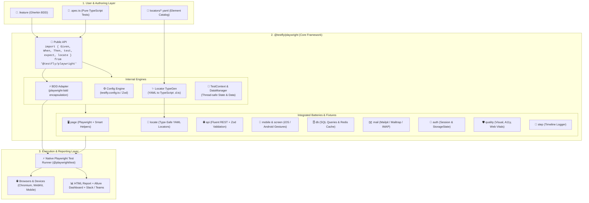

# TestFly Playwright (`@testfly/playwright`)

> **"The Next.js of Test Automation"** — Zero-boilerplate, type-safe, batteries-included TypeScript & Playwright framework with native BDD and multi-platform automation support.

[🇬🇧 English Documentation](./README.md) | [🇹🇷 Türkçe Dökümantasyon](./README_tr.md)

---

## 🌟 Vision & Philosophy

We are bringing the **"Spring Boot of Selenium"** philosophy from TestFly's Java ecosystem into the modern web & mobile standard: **TypeScript & Playwright**.

- 🚀 **Zero-Boilerplate:** No `createBdd`, no complex test runner configurations, and no repetitive plumbing code.
- 🎭 **Native Playwright Engine:** Even BDD scenarios run `%100` on the native Playwright engine (`@playwright/test`). Trace Viewer, UI Mode, Sharding, and Worker isolation work out of the box.
- 🎯 **YAML Object Repository & TypeGen:** Automatically compile `.yaml` locator definitions into strongly typed `locators/index.d.ts` declarations with 100% IDE autocomplete.
- 📱 **Mobilewright:** Native iOS & Android automation, automated device detection (`DeviceDetector`), and full gesture support (`swipe`, `longPress`, `tap`, `pinch`).
- 🔋 **Batteries-Included:** UI, REST API (with Zod schema validation), DB & Redis, Mail OTP polling, Visual Snapshot Regression, Axe-core Accessibility, and Core Web Vitals all pre-configured.
- 🧠 **Isolated Scenario State:** Thread-safe `scenarioContext` and `testData` manager for clean cross-step state passing and `{{token}}` string interpolation.

---

## 🏛️ Architecture Overview



---

## ⚡ Quickstart

### 1. Initialize a New Project
```bash
npx @testfly/playwright init
```

### 2. Define YAML Locators (`locators/login.yaml`)
```yaml
page: login
elements:
  username_field:
    role: textbox
    name: "Username"
  password_field:
    css: "#password"
  login_button:
    role: button
    name: "Login"
```

Compile TypeScript locator types:
```bash
npx testfly locators
```

### 3. Write a BDD Scenario (`features/login.feature`)
```gherkin
Feature: User Authentication

  Scenario: Successful user login
    Given the user navigates to the login page
    When the user enters username and password
    And clicks the login button
    Then the dashboard should be visible
```

### 4. Implement Step Definitions (`steps/login.steps.ts`)
```typescript
import { Given, When, Then, expect } from '@testfly/playwright';

Given('the user navigates to the login page', async ({ page }) => {
  await page.goto('/login');
});

When('the user enters username and password', async ({ locate }) => {
  // 100% Type-Safe with Full IDE Autocomplete
  await locate('login.username_field').fill('standard_user');
  await locate('login.password_field').fill('secret_sauce');
});

When('clicks the login button', async ({ locate }) => {
  await locate('login.login_button').click();
});

Then('the dashboard should be visible', async ({ page }) => {
  await expect(page).toHaveURL(/inventory/);
});
```

---

## 📱 Mobilewright: Native iOS & Android Automation

TestFly Playwright brings first-class **Mobile Automation** to Playwright using the native `{ mobile, screen }` fixtures:

### 1. Mobile BDD Scenario (`features/mobile-onboarding.feature`)
```gherkin
@mobile @ios @android
Feature: Mobile App Onboarding & Gestures

  Scenario: User navigates through onboarding and triggers gestures
    Given the mobile app is launched
    When the user swipes "left" on the onboarding carousel
    And long presses the "Get Started" button
    Then the login screen should be visible
```

### 2. Mobile Step Definitions (`steps/mobile.steps.ts`)
```typescript
import { Given, When, Then, expect } from '@testfly/playwright';

Given('the mobile app is launched', async ({ mobile }) => {
  await mobile.launchApp();
});

When('the user swipes {string} on the onboarding carousel', async ({ screen }, direction: 'left' | 'right') => {
  const carousel = screen.getByLabel('OnboardingCarousel');
  await carousel.swipe(direction, { distance: 300 });
});

When('long presses the {string} button', async ({ screen }, buttonName: string) => {
  const button = screen.getByText(buttonName);
  await button.longPress(1500);
});

Then('the login screen should be visible', async ({ screen }) => {
  const loginHeader = screen.getByRole('header', { name: 'Welcome Back' });
  expect(await loginHeader.toBeVisible()).toBe(true);
});
```

### 3. Cross-Platform YAML Locators (`locators/mobile.yaml`)
Target Web, iOS, and Android elements in a single file with automatic platform resolution:
```yaml
page: mobile_login
elements:
  submit_btn:
    web: { role: button, name: "Sign In" }
    ios: { label: "btn_signIn_ios" }
    android: { testid: "btn_signIn_android" }
```

### 4. Device Detection CLI
Scan available iOS Simulators and Android Emulators/Real Devices:
```bash
npx testfly mobile
```

---

## 🔌 Omnichannel Full-Stack E2E Flow

TestFly seamlessly blends UI, API, Database, Redis, and Email into a single test:

```typescript
import { test, expect } from '@testfly/playwright';

test('Omnichannel User Registration & OTP Verification', async ({ api, db, mail, page, scenarioContext }) => {
  // 1. Create user via API
  const res = await api.post('/api/v1/auth/register', {
    data: { email: 'john.doe@testfly.dev', name: 'John Doe' },
  });
  expect(res.status).toBe(201);
  scenarioContext.set('userId', res.data.id);

  // 2. Verify Redis cache
  const cachedUser = await db.redis.get(`user:${scenarioContext.get('userId')}`);
  expect(cachedUser).toBeDefined();

  // 3. Poll for activation email with OTP code
  const email = await mail.waitForEmail({
    to: 'john.doe@testfly.dev',
    subjectPattern: /Verification Code/,
    timeoutMs: 5000,
  });
  const otpCode = email.body.match(/\b\d{6}\b/)?.[0];

  // 4. Complete verification in Browser UI
  await page.goto('/verify');
  await page.fill('#otp-input', otpCode!);
  await page.click('#submit-btn');

  // 5. Assert database record status
  const userRow = await db.query('SELECT status FROM users WHERE id = $1', [scenarioContext.get('userId')]);
  expect(userRow[0].status).toBe('ACTIVE');
});
```

---

## 🛡️ Quality Gates: Visual, A11y, and Performance

```typescript
import { test, expect } from '@testfly/playwright';

test('Quality Gate Audits', async ({ page, visual, a11y, performance }) => {
  await page.goto('/');

  // 1. Accessibility (WCAG 2.1 AA Axe-core audit)
  await a11y.assertNoViolations({ tags: ['wcag2a', 'wcag2aa'] });

  // 2. Visual Regression Snapshot
  await visual.assertSnapshot(page, 'homepage-hero');

  // 3. Core Web Vitals (LCP, CLS, TTFB)
  await performance.assertThresholds({
    lcp: 2500, // Max 2.5s Largest Contentful Paint
    cls: 0.1,  // Max 0.1 Cumulative Layout Shift
    ttfb: 600, // Max 600ms Time To First Byte
  });
});
```

---

## 🛠️ CLI Cheatsheet

| Command | Description |
| :--- | :--- |
| `npx testfly test` | Runs all BDD (.feature) and standard (.spec.ts) tests |
| `npx testfly test --ui` | Opens Playwright Interactive UI mode |
| `npx testfly clean` | Removes generated test artifacts and reports (`reports/`, `allure-results/`) |
| `npx testfly locators` | Scans YAML locator files and generates `locators/index.d.ts` |
| `npx testfly locators --watch` | Watches YAML files and regenerates types on change |
| `npx testfly mobile` | Detects and lists connected Android & iOS devices/simulators |
| `npx testfly doctor` | Performs health checks on node, dependencies, and configurations |
| `npx testfly generate swagger.json` | Converts OpenAPI/Swagger specs into ready-to-run BDD feature scenarios |
| `npx testfly ci github` | Scaffolds `.github/workflows/testfly.yml` CI/CD pipeline |
| `npx testfly report --allure` | Launches live Allure Report Dashboard |

---

## 📑 Documentation

- [Architecture & Design (`ARCHITECTURE.md`)](./ARCHITECTURE.md)
- [MVP Specification (`MVP_SPEC.md`)](./MVP_SPEC.md)
- [Development Roadmap (`ROADMAP.md`)](./ROADMAP.md)

---

## 📄 License
Apache-2.0 © TestFly Team
