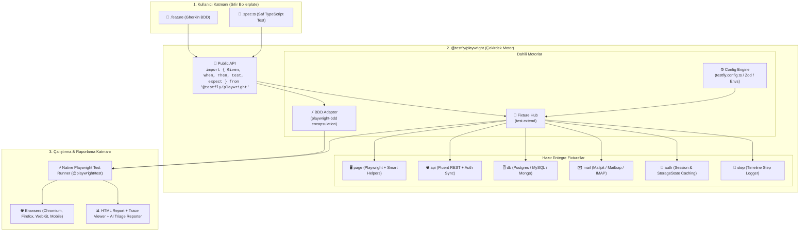

# TestFly Playwright (`@testfly/playwright`)

> **"The Next.js of Test Automation"** — Zero-boilerplate, type-safe, batteries-included TypeScript & Playwright framework with native BDD support.

---

## 🌟 Vizyon ve Felsefe

TestFly'ın Java ekosistemindeki **"Spring Boot of Selenium"** felsefesini, modern web dünyasının standardı olan **TypeScript & Playwright** ekosistemine taşıyoruz.

- **Zero-Boilerplate:** `createBdd`, karmaşık runner konfigürasyonları veya katmanlı tesisat kodları yok.
- **Native Playwright Engine:** BDD testleri dahi `%100` saf Playwright motorunda (`@playwright/test`) koşar. Trace Viewer, UI Mode, Sharding ve Worker izolasyonu eksiksiz çalışır.
- **Batteries-Included:** UI, REST API, Veritabanı, E-posta doğrulama ve Adım Loglama tek bir zenginleştirilmiş `test` nesnesi ve `fixtures` ile gelir.
- **Type-Safe:** `Zod` ve TypeScript ile tam tip güvenliği sağlayan konfigürasyon yönetimi.

---

## 🏛️ Mimari Şema



---

## ⚡ Hızlı Bakış: Geliştirici Deneyimi (DX)

### 1. BDD Senaryosu (`features/checkout.feature`)
```gherkin
Feature: Sipariş ve Ödeme Akışı

  Scenario: Kayıtlı kullanıcı ürün satın alır
    Given sistemde "premium" rolünde bir kullanıcı bulunur
    And kullanıcının sepetinde "Laptop" ürünü vardır
    When kullanıcı ödeme adımını tamamlar
    Then sipariş veritabanında "COMPLETED" olarak onaylanır
    And kullanıcıya onay e-postası ulaşır
```

### 2. Step Tanımları (`steps/checkout.steps.ts`)
```typescript
import { Given, When, Then } from '@testfly/playwright';

Given('sistemde {string} rolünde bir kullanıcı bulunur', async ({ db, api }, role: string) => {
  const user = await db.users.create({ role });
  await api.auth.setToken(user.token);
});

Given('kullanıcının sepetinde {string} ürünü vardır', async ({ api }, item: string) => {
  await api.cart.addItem({ item });
});

When('kullanıcı ödeme adımını tamamlar', async ({ page }) => {
  await page.goto('/checkout');
  await page.click('#pay-now');
});

Then('sipariş veritabanında {string} olarak onaylanır', async ({ db }, status: string) => {
  await db.orders.assertStatus(status);
});

Then('kullanıcıya onay e-postası ulaşır', async ({ mail }) => {
  const email = await mail.waitForEmail({ subject: 'Sipariş Onayı' });
  expect(email).toBeDefined();
});
```

### 3. Saf TypeScript Testi (`tests/api-flow.spec.ts`)
```typescript
import { test, expect } from '@testfly/playwright';

test('Doğrudan API ve DB entegrasyon testi', async ({ api, db }) => {
  const response = await api.post('/api/v1/orders', { data: { product: 'Phone' } });
  expect(response.status).toBe(201);

  const row = await db.orders.findById(response.data.id);
  expect(row.status).toBe('PENDING');
});
```

---

## 📑 Belgeler Dizini

- [Mimari ve Tasarım Detayları (`ARCHITECTURE.md`)](./ARCHITECTURE.md)
- [MVP Kapsam Dokümanı (`MVP_SPEC.md`)](./MVP_SPEC.md)
- [Geliştirme Yol Haritası (`ROADMAP.md`)](./ROADMAP.md)
