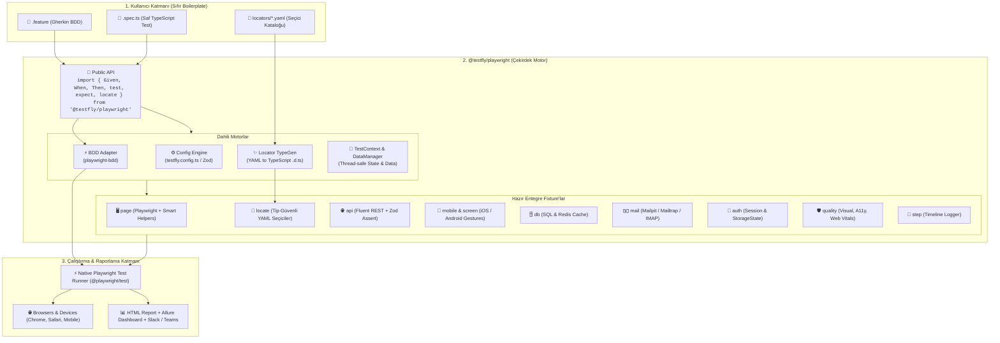

# TestFly Playwright (`@testfly/playwright`)

> **"Test Otomasyonunun Next.js'i"** — Sıfır boilerplate, tip-güvenli, her şey dahil (batteries-included) TypeScript & Playwright test otomasyon framework'ü.

[🇬🇧 English Documentation](./README.md) | [🇹🇷 Türkçe Dökümantasyon](./README_tr.md)

---

## 🌟 Vizyon ve Felsefe

TestFly'ın Java ekosistemindeki **"Spring Boot of Selenium"** felsefesini, modern web ve mobil dünyasının standardı olan **TypeScript & Playwright** ekosistemine taşıyoruz.

- 🚀 **Zero-Boilerplate:** `createBdd`, karmaşık runner konfigürasyonları veya katmanlı tesisat kodları yok.
- 🎭 **Native Playwright Motoru:** BDD testleri dahi `%100` saf Playwright motorunda (`@playwright/test`) koşar. Trace Viewer, UI Mode, Sharding ve Worker izolasyonu eksiksiz çalışır.
- 🎯 **YAML Nesne Deposu & TypeGen:** `.yaml` seçici dosyalarından otomatik `locators/index.d.ts` üretimi ile %100 IDE otomatik tamamlama (Autocomplete) ve tip güvenliği.
- 📱 **Mobilewright:** Native iOS & Android otomasyonu, otomatik cihaz tespiti (`DeviceDetector`) ve gelişmiş jestler (`swipe`, `longPress`, `tap`, `pinch`).
- 🔋 **Her Şey Dahil (Batteries-Included):** UI, REST API (Zod şema doğrulamalı), DB & Redis, E-posta OTP yakalama, Görsel Karşılaştırma, Axe-core Erişilebilirlik ve Core Web Vitals tek bir zenginleştirilmiş `fixtures` ekosisteminde.
- 🧠 **İzole Senaryo Durumu:** `scenarioContext` ve `testData` yöneticisi ile senaryolar arası dinamik veri taşıma ve `{{token}}` string interpolasyonu.

---

## 🏛️ Mimari Şema



---

## ⚡ Hızlı Başlangıç

### 1. Yeni Proje Başlatma
```bash
npx @testfly/playwright init
```

### 2. YAML Seçici Tanımlama (`locators/login.yaml`)
```yaml
page: login
elements:
  username_field:
    role: textbox
    name: "Username"
  password_field:
    css: "#password"
  login_button:
    role: button
    name: "Login"
```

Seçici tiplerini derlemek için:
```bash
npx testfly locators
```

### 3. BDD Senaryosu (`features/login.feature`)
```gherkin
Feature: Kullanıcı Giriş Akışı

  Scenario: Başarılı kullanıcı girişi
    Given kullanıcı login sayfasını açar
    When kullanıcı adı ve şifresini girer
    And giriş yap butonuna tıklar
    Then ana sayfa başarıyla görüntülenmelidir
```

### 4. Step Tanımları (`steps/login.steps.ts`)
```typescript
import { Given, When, Then, expect } from '@testfly/playwright';

Given('kullanıcı login sayfasını açar', async ({ page }) => {
  await page.goto('/login');
});

When('kullanıcı adı ve şifresini girer', async ({ locate }) => {
  // %100 Tip Güvenli ve IDE Otomatik Tamamlama
  await locate('login.username_field').fill('standard_user');
  await locate('login.password_field').fill('secret_sauce');
});

When('giriş yap butonuna tıklar', async ({ locate }) => {
  await locate('login.login_button').click();
});

Then('ana sayfa başarıyla görüntülenmelidir', async ({ page }) => {
  await expect(page).toHaveURL(/inventory/);
});
```

---

## 📱 Mobilewright: Native iOS & Android Otomasyonu

TestFly Playwright, `{ mobile, screen }` fixture'ları ile Playwright deneyimini **Native Mobil Otomasyona** taşır:

### 1. Mobil BDD Senaryosu (`features/mobile-onboarding.feature`)
```gherkin
@mobile @ios @android
Feature: Mobil Uygulama Tanıtım & Jestler

  Scenario: Kullanıcı onboarding adımlarını kaydırarak tamamlar
    Given mobil uygulama başlatılır
    When kullanıcı karşılama ekranını "sol" yöne kaydırır
    And "Başla" butonuna 1.5 saniye basılı tutar
    Then giriş ekranı başarıyla görüntülenmelidir
```

### 2. Mobil Step Tanımları (`steps/mobile.steps.ts`)
```typescript
import { Given, When, Then, expect } from '@testfly/playwright';

Given('mobil uygulama başlatılır', async ({ mobile }) => {
  await mobile.launchApp();
});

When('kullanıcı karşılama ekranını {string} yöne kaydırır', async ({ screen }, yon: string) => {
  const carousel = screen.getByLabel('OnboardingCarousel');
  await carousel.swipe(yon === 'sol' ? 'left' : 'right', { distance: 300 });
});

When('{string} butonuna 1.5 saniye basılı tutar', async ({ screen }, buttonName: string) => {
  const button = screen.getByText(buttonName);
  await button.longPress(1500);
});

Then('giriş ekranı başarıyla görüntülenmelidir', async ({ screen }) => {
  const header = screen.getByRole('header', { name: 'Hoş Geldiniz' });
  expect(await header.toBeVisible()).toBe(true);
});
```

### 3. Çoklu Platform YAML Seçicileri (`locators/mobile.yaml`)
Tek bir dosyada Web, iOS ve Android seçicilerini yönetin:
```yaml
page: mobile_login
elements:
  submit_btn:
    web: { role: button, name: "Giriş Yap" }
    ios: { label: "btn_signIn_ios" }
    android: { testid: "btn_signIn_android" }
```

### 4. Cihaz Tespiti CLI Komutu
Bağlı Android ve iOS emülatörlerini / fiziksel cihazları tarayın:
```bash
npx testfly mobile
```

---

## 🔌 Omnichannel Full-Stack E2E Akışı

TestFly; UI, REST API, Veritabanı, Redis ve E-posta adımlarını tek bir senaryoda harmanlar:

```typescript
import { test, expect } from '@testfly/playwright';

test('Omnichannel Kullanıcı Kaydı ve OTP Doğrulama', async ({ api, db, mail, page, scenarioContext }) => {
  // 1. API üzerinden kullanıcıyı oluştur
  const res = await api.post('/api/v1/auth/register', {
    data: { email: 'john.doe@testfly.dev', name: 'John Doe' },
  });
  expect(res.status).toBe(201);
  scenarioContext.set('userId', res.data.id);

  // 2. Redis önbelleğini doğrula
  const cachedUser = await db.redis.get(`user:${scenarioContext.get('userId')}`);
  expect(cachedUser).toBeDefined();

  // 3. E-postaya gelen 6 haneli OTP kodunu yakala
  const email = await mail.waitForEmail({
    to: 'john.doe@testfly.dev',
    subjectPattern: /Doğrulama Kodu/,
    timeoutMs: 5000,
  });
  const otpCode = email.body.match(/\b\d{6}\b/)?.[0];

  // 4. Web UI üzerinden OTP kodunu gir ve onayla
  await page.goto('/verify');
  await page.fill('#otp-input', otpCode!);
  await page.click('#submit-btn');

  // 5. Veritabanı tablosundaki güncel durumu kontrol et
  const userRow = await db.query('SELECT status FROM users WHERE id = $1', [scenarioContext.get('userId')]);
  expect(userRow[0].status).toBe('ACTIVE');
});
```

---

## 🛡️ Kalite Kapıları: Görsel, Erişilebilirlik ve Performans

```typescript
import { test, expect } from '@testfly/playwright';

test('Kalite Kapısı Denetimleri', async ({ page, visual, a11y, performance }) => {
  await page.goto('/');

  // 1. Axe-core Erişilebilirlik Denetimi (WCAG 2.1 AA)
  await a11y.assertNoViolations({ tags: ['wcag2a', 'wcag2aa'] });

  // 2. Piksel Hassasiyetli Görsel Snapshot Testi
  await visual.assertSnapshot(page, 'homepage-hero');

  // 3. Google Core Web Vitals Performans Bütçesi
  await performance.assertThresholds({
    lcp: 2500, // En geç 2.5s LCP
    cls: 0.1,  // En fazla 0.1 CLS
    ttfb: 600, // En fazla 600ms TTFB
  });
});
```

---

## 🛠️ CLI Komutları

| Komut | Açıklama |
| :--- | :--- |
| `npx testfly test` | BDD (.feature) ve Spec (.spec.ts) testlerini koşar |
| `npx testfly test --ui` | Etkileşimli Playwright UI modunu açar |
| `npx testfly clean` | Geçici rapor ve kalıntıları temizler (`mvn clean` gibi) |
| `npx testfly locators` | YAML seçicilerini tarar ve TypeScript `index.d.ts` üretir |
| `npx testfly locators --watch` | YAML dosyalarını izler ve anında tipleri günceller |
| `npx testfly mobile` | Bağlı Android ve iOS cihazlarını listeler |
| `npx testfly doctor` | Ortam gereksinimlerini ve yapılandırma sağlığını denetler |
| `npx testfly generate swagger.json` | OpenAPI şemasından otomatik BDD .feature senaryoları üretir |
| `npx testfly ci github` | GitHub Actions CI/CD pipeline iş akışını (.yml) oluşturur |
| `npx testfly report --allure` | Canlı Allure Dashboard raporunu sunar |

---

## 📑 Dokümantasyon

- [Mimari ve Tasarım Detayları (`ARCHITECTURE.md`)](./ARCHITECTURE.md)
- [MVP Kapsam Dokümanı (`MVP_SPEC.md`)](./MVP_SPEC.md)
- [Geliştirme Yol Haritası (`ROADMAP.md`)](./ROADMAP.md)

---

## 📄 Lisans
Apache-2.0 © TestFly Team
